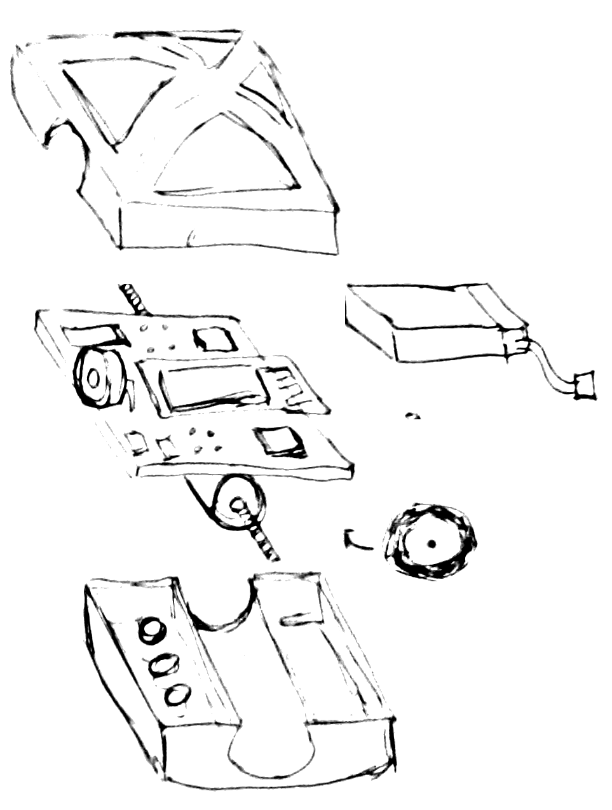

===========================
 Ciril: a Cubic Inch Robot
===========================

The ESP8266 opens up new possibilities for hardware
design of educational robots.  This project aims to
put together an open hardware design compatible with
the `Flobot <http://github.com/mnemote/flobot>`_ project and also 
projects such as `NodeMCU <http://nodemcu.com/>`_.

The eventual aim is for dimensions of approximately
1 cubic inch (25 x 25 x 25 mm = 16 cubic centimeters),
but the immediate goal is approximately 40 x 40 x 40 mm
(4 cubic inches).

The main board features two miniature stepper motors 
soldered directly to the PCB and driving two very small 
wheels.  It is designed to run around on a desktop so 
very little ground clearance is needed.

An ESP12-E module is soldered directly to the main board
with its antenna protruding over the edge of the main board
to reduce signal interference.

A micro-USB port allows charging the built-in LiPo battery
and reflashing the ESP8266 via a serial port converter.

Sensors include a line-following sensor, ambient light sensor
and an ultrasonic range sensor.

A 3D printed shell on the top and bottom of the robot provides
protection and physical support.  The lower shell supports the
motors, light guides for the line-following sensors and has skids
at either end.  The upper shell has a rounded, childs-hand-friendly
shape, with cutouts to expose the range sensor and reveal the PCB
and battery inside.

Very much just started development!

Parts
=====

A quick manifest of parts which seem like candidates:

Processor
---------

* ESP8266 on ESP-12E module.  This has the most pins available of the
  ESP8266 modules and can be picked up for around AUD5 on Ebay.

Wheel Motors
------------

* Micro-stepper motors from Ebay in 4,6,10,15mm diameters. * Very small rubber wheels/tyres and also model airplane foam wheels.
* Direct driving the wheels from tiny steppers is not ideal, other options
  like rubber band drive belts may need to be considered.
* this will require some experimentation.

Motor drivers
-------------

Driving two bipolar stepper motors is going to take 8 half H-bridges and
8 I/O pins.  It'd be great to get the pin count down by being a bit clever
about this.  The tiniest stepper motors probably draw about 50mA so there's
some room to move here ...

* `L9110S <http://www.elecrow.com/download/datasheet-l9110.pdf>`_ or
  `LV8548MC <http://www.mouser.com/ds/2/308/ENA2038-D-119504.pdf>`_ or similar. 
* Or maybe drive motors directly from a CMOS type buffer if the current
  draw is low enough.  A dual-quad-latch would reduce pin count a little. 
* It is also possible that an `ATtiny2313 <http://www.atmel.com/images/doc2543.pdf>`_ or similar could communicate with the main processor over I2C and directly drive the steppers from its output pins.

Line Follower
-------------

Maybe use two infrared proximity sensors such as `QRD1114 <https://www.fairchildsemi.com/datasheets/QR/QRD1114.pdf>`_.

Or maybe use two LEDs pointing down, either side of a single analog
photodiode feeding into the ADC pin.  By switching the LEDs on and off
and monitoring light level change, we can extract analog line follower
information from the single ADC.

Ambient Light
-------------

An LDR pointing upwards would provide a decent enough ambient light sensor 
to demonstrate phototaxis.  We've only got one ADC pin to play with but
can maybe use some output pins to choose between light sensors.

Proximity Sensor
----------------

There are `heaps of modules around <http://www.ebay.com.au/sch/i.html?_nkw=ultrasonic+module>`_ which use a pair of ultrasonic
transducers, one to transmit and one to receive.  However, we should be
able to do better and use a single device with clever driver software to
switch from transmit to receive.  Accuracy isn't that important so long
as we can detect a barrier.

Alternatives are the `Sharp Infrared distance sensors <http://www.sharpsma.com/webfm_send/1489>`_ or similar.

